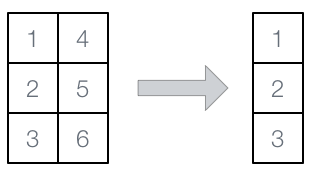
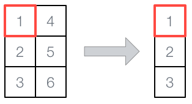

```{r, include = FALSE}
knitr::opts_chunk$set(
  collapse = TRUE,
  comment = "#>"
)
```

```{r setup}
library(demiter)
```

## Introduction


## Iterators


## Collapse Iterators








```{r}
spec <- SpecIterCollapse(dim_self = c(3, 2),
                         dim_oth = 2,
                         map_dim = c(0, 1),
                         map_pos = list(c(0, 0, 0), 1:2))
```

```{r}
iter <- iter_create_collapse(spec)
```

```{r}
iter_has_next_collapse(iter)
```


## Cohort Iterators

## Increment Iterators

## Account Iterators